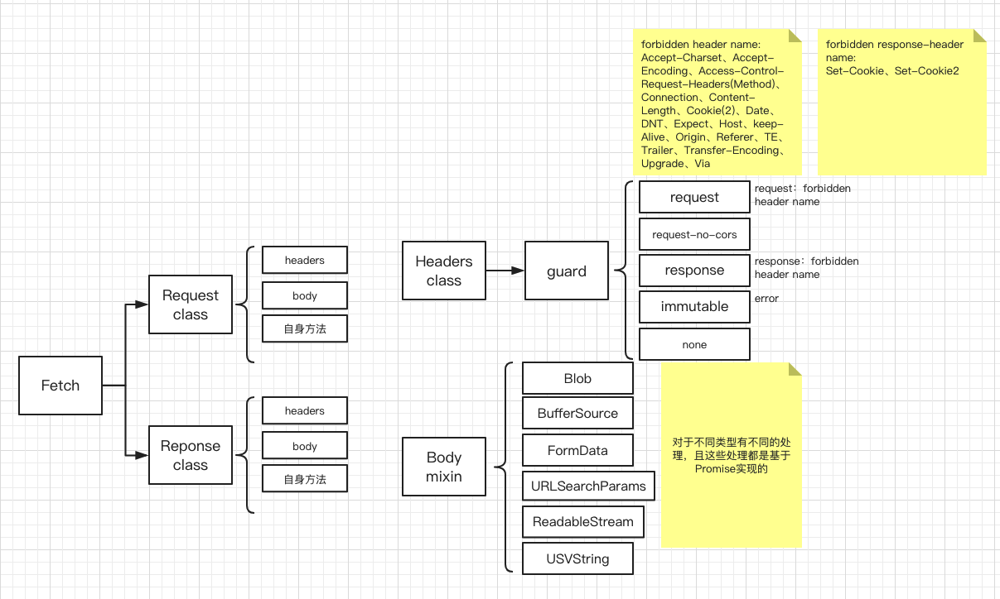
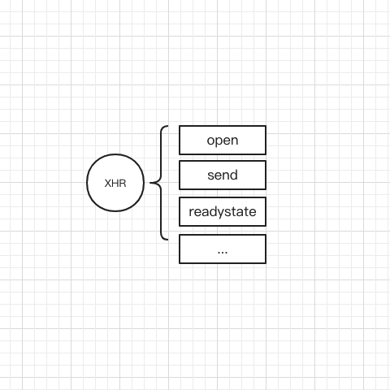
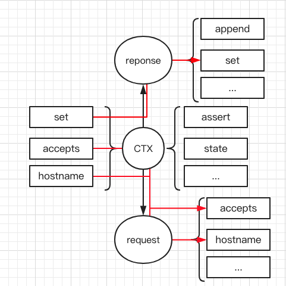
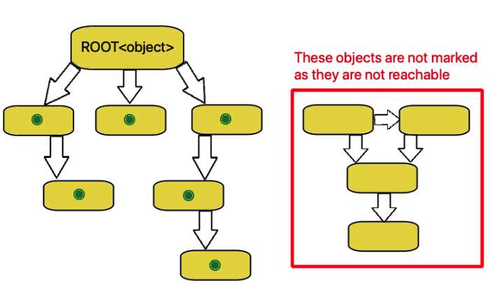
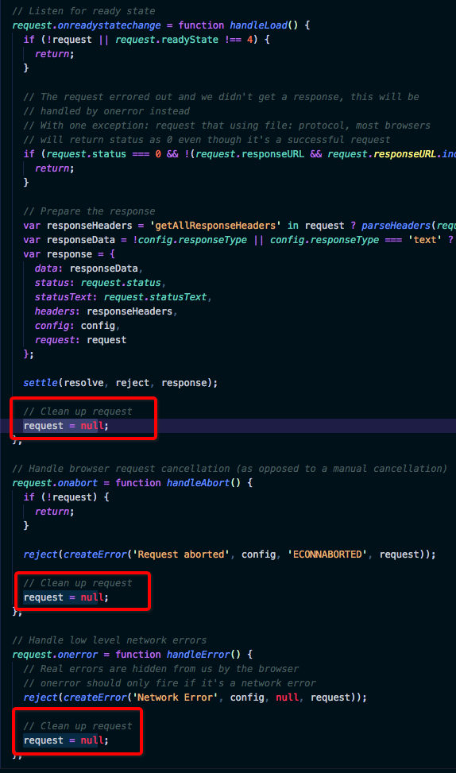
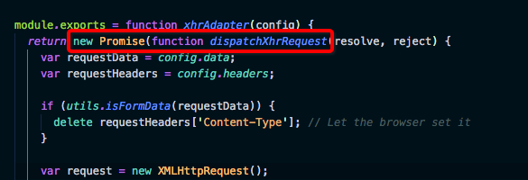
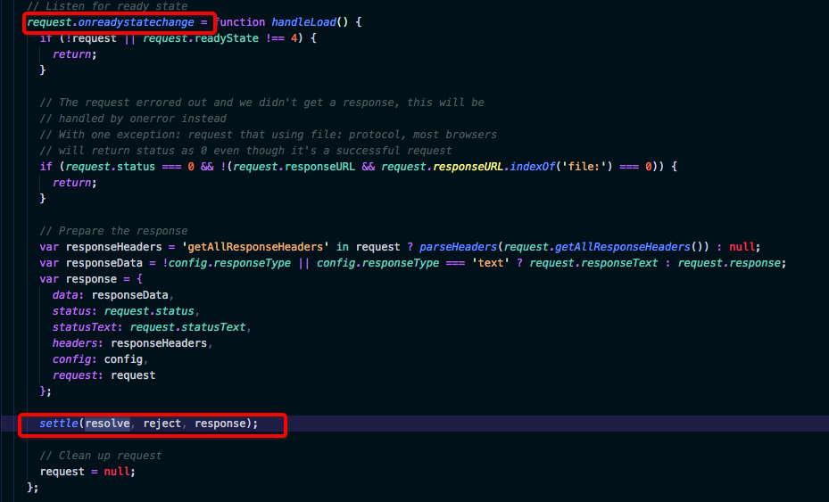
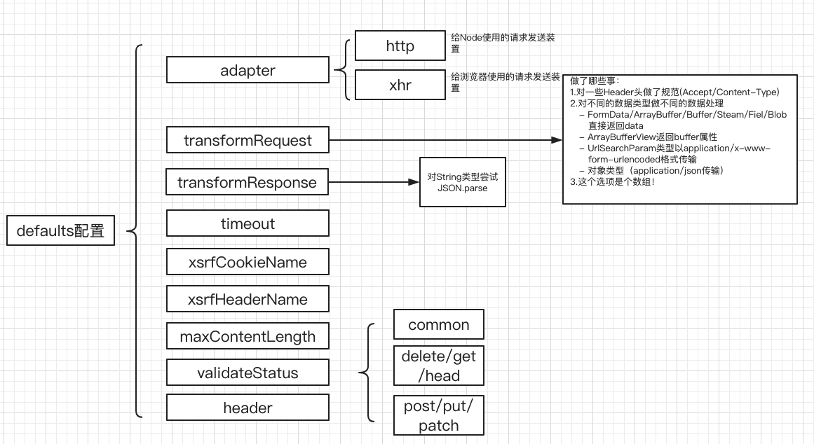

title: xhr和fetch和axios
speaker: tang
plugins:
    - echarts
    - katex
prismTheme: solarizedlight

<slide class="bg-black-blue aligncenter" image="https://ww3.sinaimg.cn/mw690/6f0b9c3ftw1egcgfr2fy3j20go0on777.jpg">

# xhr和fetch和axios {.text-landing.text-shadow}

By tang {.text-intro}

<!-- [:fa-github: Github](https://github.com/ksky521/nodeppt){.button.ghost} -->

<slide image=".dark" class='slide-top'>
:::{.content-left}
为什么会有XMLHttpRequest{.animated.fadeInDown.delay-300}
- 【问题】早期网页获取任何数据就需要全页面刷新 {.animated.fadeInDown.delay-600}
- 【解决方案】XMLHttpRequest{.animated.fadeInDown.delay-600}


:::
:::{.content-right}
XMLHttpRequest是什么{.animated.fadeInDown.delay-300}
 - XMLHttpRequest是一个对象{.animated.fadeInDown.delay-600}
 - XMLHttpRequest提供Http方法获取数据同时不需要刷新整个页面{.animated.fadeInDown.delay-600}
 - XMLHttpRequset并不像它的名字一样只获取XML类型数据{.animated.fadeInDown.delay-600}
:::

<slide >
What does XMLHttpRequest have ?
 - Event handler： onloadstart、onprogress、onabort、onerror、onload、ontimeout、onloadend、onreadystatechange
 - readyState： unsent(0)、opened(1)、headers received(2)、loading(3)、done(4) (XMLHttpRequest's state)
:::{.content-left}
 - Request（concept）
    - [method] open(method, url [,[async = true](https://developer.mozilla.org/zh-CN/docs/Web/API/XMLHttpRequest/Synchronous_and_Asynchronous_Requests#%E5%90%8C%E6%AD%A5%E8%AF%B7%E6%B1%82) [,[username [ ,password](https://www.jianshu.com/p/e35db347935c) ]]])
    - [method] setRequestHeader(name, value)
    - [attr] timeout
    - [attr] **withCredentials：cross-origin**
    - [attr] upload
    - [method] send
    - [method] abort
:::
:::{.content-right}
 - Response（concept）
    - [attr] responseURL
    - [attr] status：200...
    - [attr] statusText
    - [method] getResponseHeader
    - [method] getAllResponseHeader
    - [method] [overrideMimeType](https://segmentfault.com/q/1010000010325236/a-1020000010408768)
    - [attr] responseType：''、'arraybuffer'、'blob'、'document'、'json'、'text'
    - [attr] response
    - [attr] responseText
    - [attr] [responseXML](https://developer.mozilla.org/zh-CN/docs/Web/API/XMLHttpRequest/responseXML)
:::

<slide class="card-80">

## XHR：withCrendentials[cors-origin]

|withCrendentials|result|same-origin|
|-|-|-|
|true|withCrendentials|无影响|
|false|notWithCrendentials|无影响|

## Fetch：credentials mode

|omit|same-origin|inlcude|
|--|--|--|
|任何请求都不带|同源时带cookie|任何时候都带cookie|

|credentials mode|`Access-Control-Allow-Origin`|`Access-Control-Allow-Credentials`|share|备注|
|--|--|--|--|--|
| 'omit' | '*'  | Omitted | 是 | |
| 'omit' | '*'  | 'true' | 是 | |
| 'omit' | 'https://www.a.com/'  | Omitted | 否 | 不应该带有末尾的'/' |
| 'omit' | 'https://www.a.com'  | Omitted | 是 | |
| 'inclued' | '*'  | 'true' | 否 | 如果credentials mode是`include`那么`Access-Control-Allow-Origin`头就不能是'*' |
| 'inclued' | ''https://www.a.com'  | 'true' | 是| |
| 'inclued' | ''https://www.a.com'  | 'True' | 否 | 大小写敏感 |

此处应该有demo
<slide image=".dark">
```js
// 手动对老版本的IE做兼容
let xhr
if (window.XMLHttpRequest) {　 // Mozilla, Safari...
  　xhr = new XMLHttpRequest();
} else if (window.ActiveXObject) { // IE
  　try {
    　xhr = new ActiveXObject('Msxml2.XMLHTTP');
 　 } catch (e) {
  　  try {
    　  xhr = new ActiveXObject('Microsoft.XMLHTTP');
   　 } catch (e) {}
 　 }
}
// onreadystatechange 方法
const onReadyStateChange = () => {
   　if (!xhr || xhr.readyState !== 4) {
       return;
     }
     // 处理文件传输的特殊情况
     if (xhr.status === 0 && !(xhr.responseURL && xhr.responseURL.indexOf('file:') === 0)) {
       return;
     }
  　 var responseData = !xhr.responseType || xhr.responseType === 'text' ? xhr.responseText : xhr.response;
}
if (xhr) {
    // 注册回调函数
  　xhr.onreadystatechange = onReadyStateChange;
  　// 打开XHR
 　 xhr.open('POST', '/api', true);
 　 // 设置XHR的Header
  　xhr.setRequestHeader('Content-Type', 'application/x-www-form-urlencoded');
  　// 发送数据
 　 xhr.send('username=admin&password=root');
}
```

<slide image=".dark">

# 缺点
1. 顺序读下去，代码不是按照顺序执行的——————不符合正常逻辑；
2. 输入数据、接收返回数据和状态的监控在一个对象下——————关注点分离；
3. 虽然XHR的一些名字取得语义化但是非常繁琐——————API低级；
# 优点
1. 发展成熟没有哪个浏览器不支持——————除了IE稍有不同；

<slide image=".dark">
# jQuery

:::{.content-left}
### 示例
```js
$.ajax({
  type: "POST",
  url: "https://www.baidu.com/test",
  data: {Name:"sanmao",Password:"sanmaoword"},
  success:function(data){
  	// 成功了           
  },
  complete: function(XMLHttpRequest, textStatus){
     // 完成了
  },
  error: function(){
      //请求出错处理
  }         
});
```
:::
:::{.content-right}

### 缺点
1. 依旧不是顺序执行的；
2. 关注点依旧没分离，还是整个在一个对象里；
3. 不仅如此非官方的命名success、complete、error、fail、done还会引起不必要的混淆；

:::

<slide image=".dark">
# Fetch
是JavaScript提供的低级API，用于请求和相应Http请求，并被认为是XMLHttpRequest的替代方案
:::{.content-left}
### 示例
```js
fetch("http://www.baidu.com", {
    mode:"cors"
  })
  .then(res => {
    let contentType = res.headers.get("content-type")
    if(contentType &&
    /application\/json/i.test(contentType)) {
      return res.json()
    } else {
      throw new TypeError()
    }
  })
  .then(processJSON)
```
:::
:::{.content-right}

### 优点
1. 基于Promise已经是顺序执行了，如果使用await来语义更明确；
2. 新规范完全脱离与XMLHttpRequest，**其实现更合理**；
3. 同构方便在node端同样也可以使用；
### 缺点
1. 太低层没有封装，许多情况需要我们自己去处理：Normalize header、formdata格式特有处理...
2. 兼容性不如XMLHttpRequest
:::

<slide image=".dark">

what does fetch have?
:::{.content-left}
 - Header class：append(name, value)、**delete(name)**、get(name)、has(name)、set(name, value)
 - Body mixin：Blob、BufferSource（TypedArray）、FormData、URLSearchParams、ReadableStream、USVString(JSON/text)
 - Request class
    - method、url、headers、destination、referrer、mode、crendentials、cache、redirect、integrity、keepalive、isReloadNavigation、isHistoryNavigation、signal(All Readonly)
    - request = new Request(input [, init ])
     - init：method、headers、body、referrer、referrerPolicy、mode、crendtials、cache、redirect、integrity、keepalive、signal
 - Response class：
    - url、redirected、status、ok、stautsText、headers、trailer(All Readonly)
    - error()、redirect(url, status)、clone()、
 - Garbage collection
:::
:::{.content-right}
 - Headers guard：immutable、request(forbidden header name)、request-no-cors、response(forbidden header name)、none
 - request的init选项就是fetch(url, init)的init选项
:::

<slide image=".light" :class="card-80">

:::gallery



## Fetch Structure

:::

<slide :class="size-60">

:::gallery


## XHR Structure

---



## KOA Structure

:::

<slide image=".light">

# Garbage collection
1. Reference-counting garbage collection
2. Mark-and-Sweep Algorithm (Unreachable)



<slide image=".light">
#Garbage collection
:::{.content-left}
### XMLHttpRequest
An XMLHttpRequest object must not be garbage collected if its state is either **opened with the send() flag set, headers received, or loading**, and it has one or more **event listeners registered** whose type is one of **readystatechange, progress, abort, error, load, timeout, and loadend**.



:::
:::{.content-right}
### Fetch
[The user agent may terminate an ongoing fetch if that termination is not observable through script.](https://fetch.spec.whatwg.org/#garbage-collection)

:::


<slide image=".light">

# axios是什么

Promise based HTTP client for the browser and node.js
:::{.content-left}


:::
:::{.content-right}

:::

<slide >
axios
# 优点
1. 基于Promise，我也能够使用async/await写顺序执行的代码；
2. 同时支持浏览器和Node，同构同样方便；
3. 由于Promise，其实我们的输入和输出关注点已经分离了；
4. 没有再定义自己的done、success、error等奇怪的名字而是使用ES6的语法来书写。
# 缺点
1. 还是基于XMLHttpRequest-但对我们无感知

<slide >
# 结论
1. XHR本身比较老、实现不合理；
2. jQuery只是进行了简单的封装书写方式不符合JavaScript未来的趋势；
3. Fetch实现更合理但API比较低级许多意外情况需要我们自己处理，兼容性略差；
4. Axios同时具备Fetch的一些优点和XHR的兼容性，且征战沙场多年非常成熟；

选择Axios
